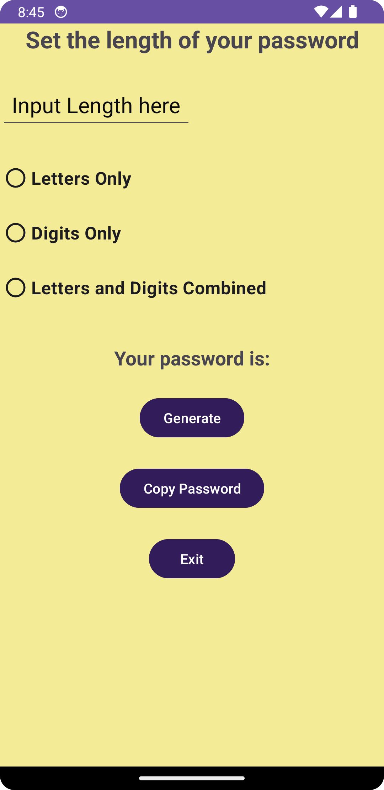
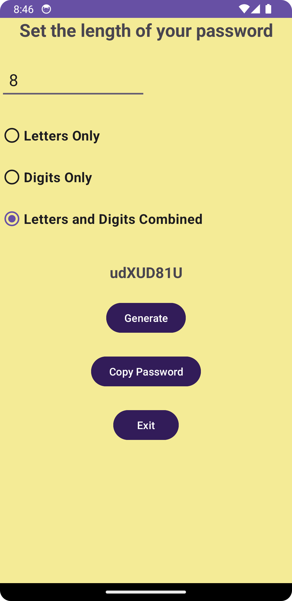
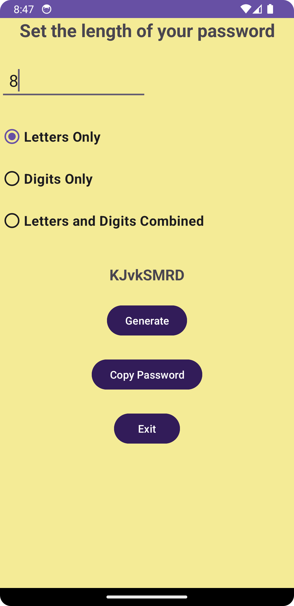

# Random Password Generator App

This Android application allows users to generate random passwords of the desired length.

It also provides the option to choose the type of password: letters only, numbers only, or a combination of letters and numbers.

## Screenshots

<table>
  <tr>
    <td></td>
    <td></td>
    <td></td>
    <td></td>
  </tr>
</table>

## Features

You can specify the password length.

Options for letters only, numbers only, or a combination of letters and numbers are available.

You can copy the generated password to the clipboard.

It has a user-friendly interface.

## Usage

To use the application, you can follow the steps below:

Open the application.

Enter a number in the "Password Length" field.

Select one of the options: "Letters Only," "Numbers Only," or "Letter and Number Combination."

Click the "Generate Password" button.

The generated password will appear on the screen.

To copy the password, click the "Copy Password" button.

To exit, click the "Exit" button.

## Contributing

If you wish to contribute to this project, you can follow these steps:

Fork this repository.

Add new features or fixes.

Submit your changes as a pull request.

## Technologies

This application uses the following technologies:

Kotlin: Kotlin is used as the programming language for the application.

Android Studio: Android Studio is used for the development of the application.

## License

This project is licensed under the MIT License.

## Developer

This application was developed by Ozan YİĞİT.
